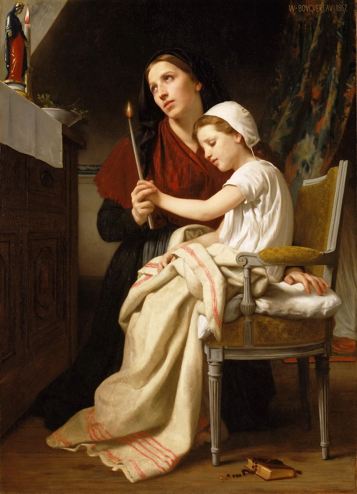

<h1 align="center">Recursos Educacionais</h1>

_Não deveria ser obrigatório, ao indivíduo que deseja educar-se tendo como fim a vida adulta ou uma atitude mais consciente sobre seus atos, o castigo da escolha entre o ensino rudimentar das abarrotadas salas de escolas públicas ou a fortuna paga todos os anos em troca de um ensino particular. Nascem, então, iniciativas próprias de estudo._

---

|                                    |
| :------------------------------------------------------------------------------------------------------------------------------------: |
| [William-Adolphe Bouguereau - Oferta de Agradecimento](https://search.creativecommons.org/photos/f1177ec7-91d1-44f9-88db-c2cd490f0820) |

Ao longo das últimas décadas, vem surgindo um número crescente de pessoas infelizes com os rumos atuais da educação humana. Esta, que outrora era vista como meio de exortar o homem à liberdade para que este assim consiga decidir e dedicar-se aos seus objetivos coerentemente, é agora fadada ao utilitarismo e ao preparo ao mercado.

A educação de hoje é repleta de jogos, cores, vídeos como babás, interações dentro das redes. Deve ser encarada como algo lúdico, uma brincadeira onde as crianças aprendem, aplicam e esquecem. Nunca uma busca séria. Em meio a este caos, há pouco que impeça uma criança ou adolescente de pensar _"se até os colegas mais bagunceiros da sala passam de ano, por que então devo eu me esforçar?"_

Eis uma minoria de indivíduos constantemente atacados por ainda crerem que a educação não deve ser diluída a isso. Socialização não deve ser privilegiada à escola. Geografia não deve ser abreviada a aspectos puramente sociais. Ciências não deve ser comprimida a visões parciais de fenômenos cujas opiniões estão constantemente em conflito. História não se resume apenas aos episódios modernos e a luta de classes. Artes não se resume à Semana de Arte Moderna e produções abstratas, disformes e subjetivas. Há de se ensinar o bom, o belo, o verdadeiro.

---

Este mapa de conteúdos carrega o propósito de iluminar tudo aquilo relacionado ao objetivo de guiar o homem à correta liberdade: opções de leitura, materiais didáticos, comunidades para dar e receber apoio, negócios familiares para potencializar, cursos e pessoas de influência para conhecer, acompanhar e aprender, tópicos e conhecimentos que podem ser aplicados de forma mais precisa e que mais se aproxima de seus valores e interesses, todos estes sem a necessidade do vínculo escolar.

Atualmente, validações de ensino como ENEM e ENCCEJA se baseiam no conteúdo da Base Nacional Comum Curricular (BNCC). Apesar disso, pode ser que se deseje optar por outros meios de educação, como a Educação Clássica, Waldorf, Slowschooling ou Montessori. Para tal, este repositório apresentará, também, listas contendo os principais tópicos esperados pela BNCC por ano escolar, as quais espera-se servir de auxílio para possíveis avaliações anuais ou estudos preparatórios para estes exames.

A educação deve ser uma aventura inesgotável a ser continuadamente trilhada com sincera humildade e empenho. Cabe a cada um empenhar-se no caminho de preparar a si e aos seus próximos para o mundo.
